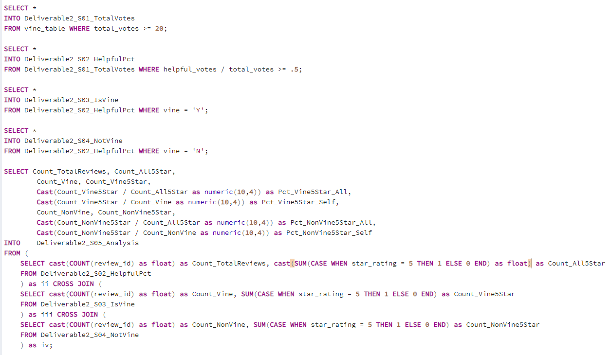
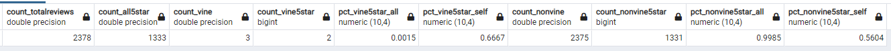

# Amazon_Vine_Analysis
## Overview of Analysis

### In this analysis we looked at Amazon review data to determine if there is a bias toward favorable, 5 star, reviews with participents in the Amazon Vine program. This analysis looks specifically at reviews for video games purchased on Amazon.

## Results

### In order to determine whether a bias toward 5 star reviews exists for Vine participents we first limited the review data to reviews with 20 or more votes, and where 50% or more of the votes were helpful. Then we calculated the number of reviews from Vine members and the percentage that were five stars, as well as the number of Non-Vine reviews and what percentage of those were five stars. Below, you will find those calculations and their results.

 - There were only 3 Vine reviews for video games, and 2375 Non-Vine reviews.
 - 2 of the Vine reviews were 5 Stars, and 1331 of the Non-Vine reviews were 5 Stars. 
 - This means that 66% of the Vine reviews were 5 star reviews, and 56% of the Non-Vine reviews were 5 star reviews. 

## Summary

### Looking at the results above, with a difference of 10% between the two review types, there does not appear to be any bias toward 5 star reviews for Vine participents, but with only 3 Vine reviews it is hard to say for certain. To better understand the data however I feel it would be good to perform this same analysis for each of the other star rating options (1-4). It may also be more productive to change the product category from video games to one with more Vine reviews.
